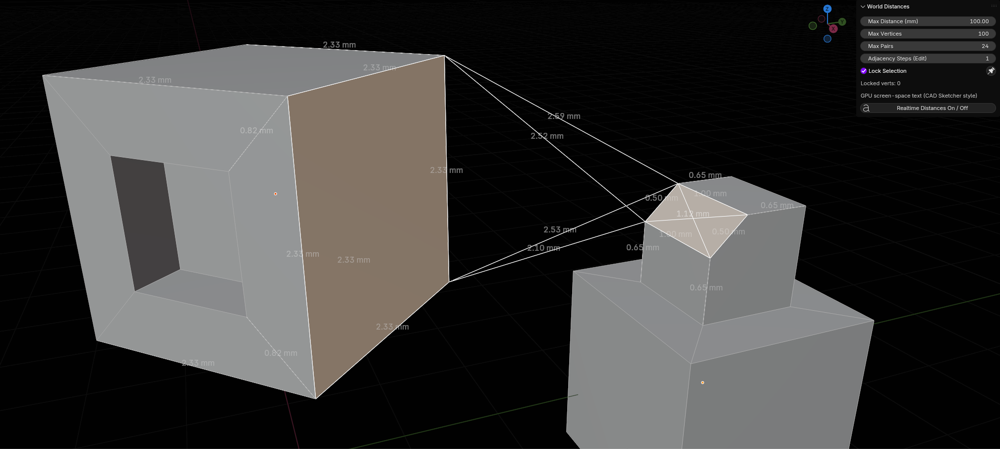

# Blender Vertex Measurements

A Blender add-on that provides real-time distance measurements between selected vertices in the 3D view, using GPU-accelerated screen-space text overlays inspired by CAD Sketcher.



## Features

- **Real-time Distance Display**: Shows distances between selected vertices as text overlays in the 3D view.
- **GPU Screen-Space Text**: Uses GPU rendering for efficient text display that scales with the view.
- **Edit and Object Mode Support**: Works in both Edit Mode (with adjacency steps) and Object Mode.
- **3D Mesh Lines**: Optionally creates visible 3D lines between measured vertices.
- **Lock Selection**: Ability to lock current vertex selections for persistent measurements.
- **Customizable Settings**: Adjust max distance, max vertices, max pairs, and adjacency depth.
- **CAD Sketcher Inspired**: Text placement and styling inspired by CAD Sketcher for professional appearance.

## Requirements

- Blender 4.4.0 or later
- Python 3.x (included with Blender)

## Installation

1. Download or clone this repository:
   ```
   git clone https://github.com/MickaelMorgado/BlenderVertexMeasurements.git
   ```

2. Open Blender and go to `Edit > Preferences > Add-ons`.

3. Click `Install...` and select the `MyCAD.py` file from the downloaded repository.

4. Enable the add-on by checking the box next to "Selected Vert-to-Vert Distances (GPU Screen-Space Text)".

## Usage

1. Select one or more mesh objects in the 3D view.

2. In Edit Mode: Select vertices, edges, or faces to measure distances between them.

3. Open the sidebar (press `N` in the 3D view) and find the "Overlay Test" category.

4. Adjust the settings in the "World Distances" panel:
   - **Max Distance (mm)**: Only show pairs within this distance (assuming 1 Blender Unit = 1 mm).
   - **Max Vertices**: Maximum number of vertices to sample.
   - **Max Pairs**: Maximum number of distance pairs to display.
   - **Adjacency Steps (Edit)**: In Edit Mode, show distances along edges up to this many steps from selected vertices.

5. Click the "Realtime Distances On / Off" button to toggle the overlay.

6. For persistent measurements, use "Lock Selection" to store the current vertex selection.

## How It Works

- The add-on calculates distances between selected vertices in world space.
- Text labels are displayed in screen space using GPU rendering for performance.
- Distance-based opacity makes closer measurements more prominent.
- 3D mesh lines can be created for visual reference.

## Contributing

Contributions are welcome! Please feel free to submit issues or pull requests on GitHub.

## License

This project is open-source. Please check the license file for details.

## Credits

Inspired by CAD Sketcher and developed with assistance from ChatGPT.
